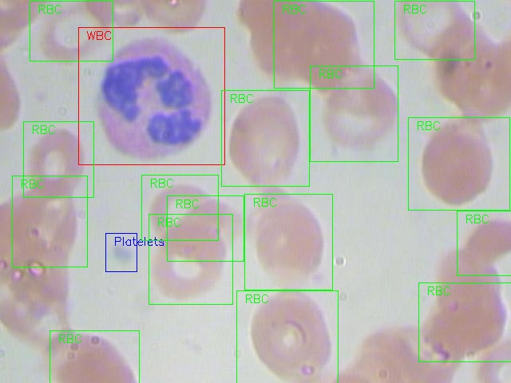

# Reconocimiento de Células Sanguíneas en imágenes microscópicas.

El siguiente proyecto tiene como objetivo implentar el algoritmo YOLO en la tarea de deteccion de objetos en este caso células sanguíneas en imágenes microscópicas.

## Base de Datos.

La base de datos utilizada consiste en 410 imágenes microscópicas con sus respectivos labels.

 Se llevará a cabo la clasificación de las siguientes células :

 * Glóbulos Rojos (RBC).
 * Glóbulos Blancos (WBC).
 * Plaquetas (Platelets).
 
 

## Preprocesado del conjunto de datos.

Gran parte del trabajo está enfocado en limpiar y preprocesar el conjunto de datos. Estos son los pasos específicos que se tomaron:

* Se redujeron las dimensiones de las imágenes de (3, 480, 640) a (3, 120, 160).

* Se normalizaron las imágenes para que el rango de valores vayan de 0 a 1.

* Aumentar la cantidad de imágenes:
  * Se rotaron las imágenes. Los ángulos de rotación fueron 90º, 180º, 270º.
  * A partir de las imágenes rotadas se invirtieron las imágenes con respecto al eje X y con respecto al eje Y.
  
El resultado total fue que se logro expandir la base de datos a 4100 imágenes. 

## Labels de las imágenes.

Con el fin de utilizar el algoritmo YOLO los labels de las imagenes fueron organizados de la siguiente manera

